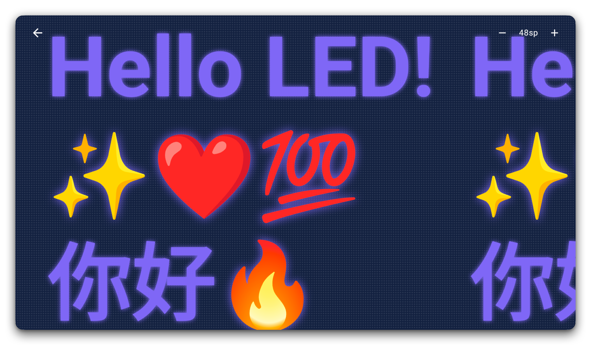
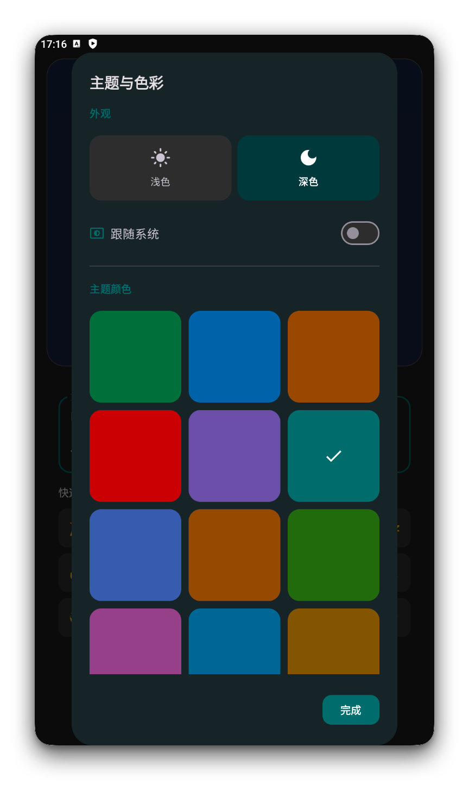
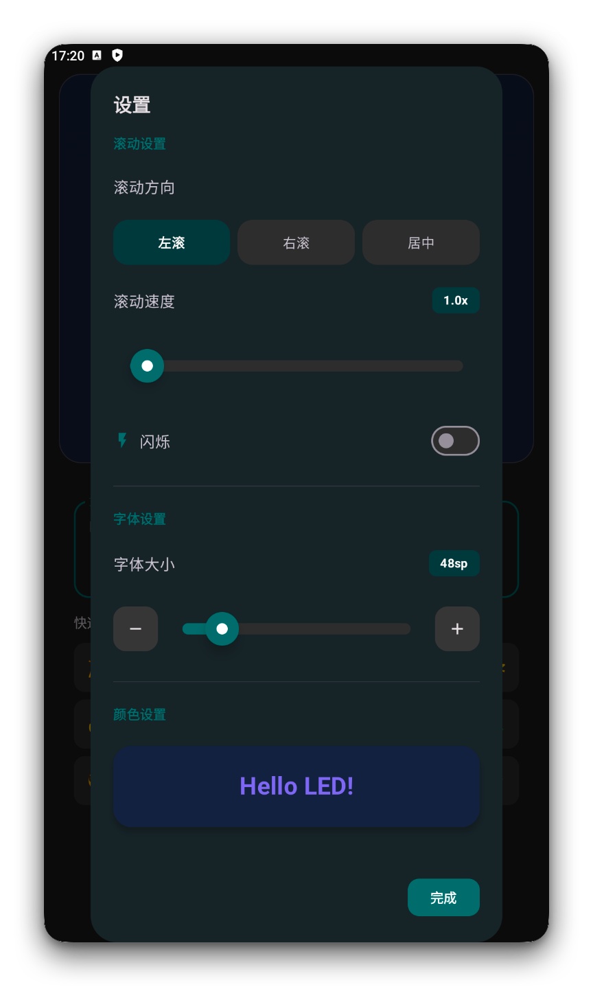
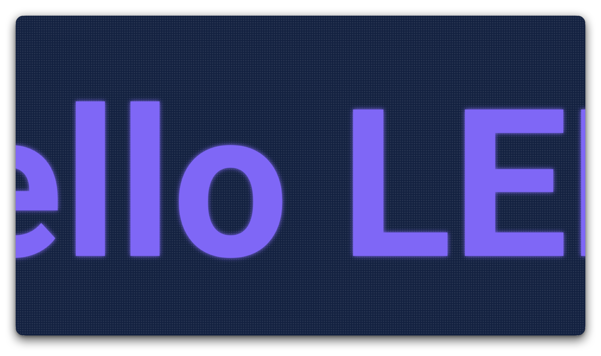

# XMLED

一款 Android LED 滚动字幕应用，支持自定义文字、颜色、滚动效果。

## 功能

- **LED 点阵效果** — Canvas 绘制真实 LED 点阵背景
- **滚动字幕** — 左滚、右滚、居中三种模式，无缝循环
- **多行文字** — 支持换行，每行独立居中
- **Emoji 支持** — 文字内容支持 Emoji 表情
- **闪烁效果** — 可调节闪烁频率
- **全屏预览** — 横屏全屏显示，点击屏幕调节字号
- **主题切换** — 12 种主题色，支持深色/浅色/跟随系统
- **颜色自定义** — 11 种文字颜色 + 11 种背景颜色
- **Material Design 3** — 现代化 UI 设计

## 截图

| 首页 | 全屏预览 | 设置 | 主题 |
|:---:|:---:|:---:|:---:|
|  |  |  |  |

## 技术栈

- Kotlin
- Jetpack Compose
- Material Design 3
- DataStore Preferences
- Canvas + Native Paint

## 环境要求

- Android Studio Hedgehog+
- Kotlin 2.0.0
- AGP 8.5.0
- compileSdk 35
- minSdk 26

## 安装

1. Clone 项目
   ```bash
   git clone https://github.com/Tosencen/XMLED.git
   ```

2. 用 Android Studio 打开项目

3. 运行到设备或模拟器

## 下载

前往 [Releases](https://github.com/Tosencen/XMLED/releases) 下载最新 APK。

## 许可

MIT License
